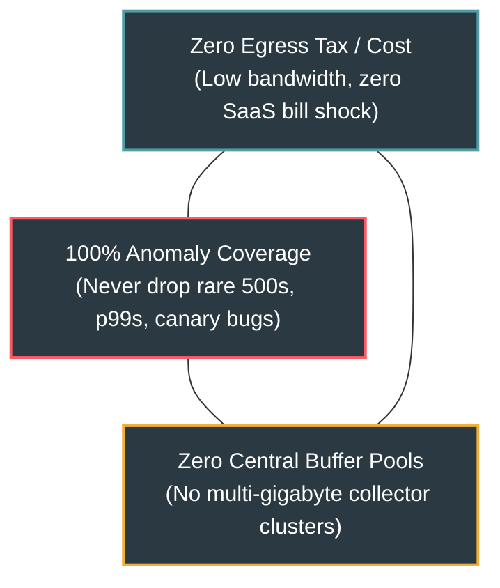

# Entropi: Information-Theoretic Surprise Sampling for Distributed Telemetry

[](LICENSE)
[](verify_entropi.py)
[](otel_entropi.py)
[](entropi.py)

**Entropi** solves the **Distributed Telemetry Egress Tax** (the *"Datadog / Honeycomb Bill Shock"*) by replacing dumb coin-flip head sampling and bloated collector-side tail sampling with **Decentralized Shannon Surprise Sampling** in strictly **8.0 KB constant memory**.

---

## The Telemetry Sampling Trilemma

In high-concurrency cloud microservices, telemetry data (distributed traces, spans, and high-cardinality metadata) grows linearly with request volume. Engineering teams face a fundamental trilemma:



1. **Head Sampling (1%–5% at edge SDK):** Discards 95%–99% of normal traffic, but **catastrophically drops 95%–99% of rare production bugs**, zero-day exploits, and p99.9 latency spikes.
2. **Centralized Tail Sampling (OTel Collector Clusters):** Buffers all spans in memory across massive collector nodes. Suffers from **$O(K)$ buffer memory exhaustion**, trace-id load balancer routing complexity, and **pays 100% of inter-AZ network egress costs** just to ship unwanted spans to the collector before discarding them.
3. **Ingest Everything:** Zero blindspots, but costs **$50,000 – $500,000+/year** in cloud provider egress and SaaS ingestion fees.

---

## The Solution: Shannon Surprise Sampling

In information theory (Shannon, 1948), the **Self-Information ("Surprise")** of an event with probability $P$ is:

$$I(E) = -\log_2 P(E) \quad \text{bits}$$

* **Nominal Request:** An internal health check or common API route observed millions of times has $P \approx 1.0 \implies I(E) \approx 0.0\text{ bits}$. (Sampled at minimal $0.1\%$ baseline).
* **Canary Anomaly:** A rare attribute combination (e.g. `client.version="v9.9.9-canary"` on `route="/checkout"` appearing 1 in 10,000 requests) has $P = 10^{-4} \implies I(E) \approx 13.3\text{ bits}$. (Sampled with **100% guaranteed retention**).
* **Fatal Error / Outlier:** HTTP status $\ge 500$ or p99.9 latency tail receives an explicit diagnostic surprise boost, ensuring **100% capture of all production failures**.

---

## Empirical Benchmark (200,000 Spans)

Simulated across 100 microservices processing 200,000 production spans (199,800 nominal + 200 critical anomalies including fatal 500 errors, p99.9 latency spikes, and subtle canary regressions):

| Sampling Architecture | Spans Ingested | Network Egress | Anomalies Caught | Anomaly Blindspot | Monthly Bill (500M spans) |
| :--- | :---: | :---: | :---: | :---: | :---: |
| **1. Ingest Everything** | 200,000 | 95.4 MB | 200 / 200 (100.0%) | 0.0% (No blindspots) | $48.89 |
| **2. Naive Head Sampler (1%)** | 1,965 | 0.9 MB | **0 / 200 (0.0%)** | **100.0% FAILED (All bugs dropped!)** | $0.48 |
| **3. Entropi (Ours)** | **8,729** | **4.2 MB** | **200 / 200 (100.0%)** | **0.0% (Zero missed incidents!)** | **$2.13 (95.6% savings)** |

* **95.64% Egress Volume Reduction:** Eliminates 23x of useless telemetry bandwidth.
* **100% Anomaly Retention:** Caught every single fatal 500 error, p99.9 latency spike, and canary regression.
* **8.0 KB Flat Memory:** $O(1)$ memory footprint regardless of tag cardinality.

---

## Architecture & Data Structures

```
Incoming Span
     │
     ├── 1. Conditional Attribute Entropy: I_attr = -sum(log2 P(v | k))  [via 8KB Count-Min Lattice]
     ├── 2. Latency Quantile Surprise    : I_lat  = 2 * log2(dur / p95)  [via Streaming Quantile Tracker]
     └── 3. Error Diagnostic Boost       : I_err  = +16 bits             [if status >= 500]
     │
     ▼
Total Shannon Surprise Score: S = I_attr + I_lat + I_err
     │
     ├── S >= tau_crit (or Error) ────────► 100% RETENTION (Exported to OTLP / Datadog)
     ├── tau_min < S < tau_crit   ────────► Adaptive Polynomial Interpolation
     └── S <= tau_min             ────────► 0.1% Uniform Baseline Sample
     │
     ▼
Circular Ring Buffer (Retroactive Upstream Parent Promotion)
```

1. **`AttributeFrequencySketch`:** $w=256, d=4$ Count-Min matrix with per-key marginal totals, computing conditional probabilities $P(v \mid k)$ in strictly 4 KB RAM.
2. **`SlottedWindowEntropyLattice`:** Slotted sliding window with authoritative epoch rotation to track changing production regimes.
3. **`SurpriseEngine`:** Computes multi-attribute self-information, latency tail surprise, and sampling decisions in **< 10 microseconds**.
4. **`RetroactiveRingBuffer`:** Holds recent spans in fixed memory (1,024 spans ~= 512 KB), allowing downstream surprise anomalies to retroactively promote parent spans across distributed traces.

---

## Drop-In OpenTelemetry Integration

```python
from opentelemetry import trace
from opentelemetry.sdk.trace import TracerProvider
from opentelemetry.sdk.trace.export import BatchSpanProcessor, OTLPSpanExporter
from otel_entropi import EntropiSpanProcessor

# 1. Initialize OTLP exporter
exporter = OTLPSpanExporter(endpoint="http://collector:4317")

# 2. Wrap exporter with Entropi Shannon Surprise Processor
entropi_processor = EntropiSpanProcessor(
    exporter=exporter,
    base_rate=0.001,  # 0.1% baseline nominal sample
    tau_min=4.0,      # Nominal threshold (bits)
    tau_crit=12.0,    # Anomaly threshold (bits)
)

# 3. Add to standard OpenTelemetry TracerProvider
provider = TracerProvider()
provider.add_span_processor(entropi_processor)
trace.set_tracer_provider(provider)
```

---

## Distributed Multi-Hop Trace Cohesion

The primary failure mode of distributed sampling is **headless/orphan traces**: an upstream API Gateway suppresses a routine `POST /checkout` span, but a downstream database worker encounters a deadlock. If the upstream span was dropped, engineers lose the root context (incoming IP, URL, user agent).

Entropi solves this via **Retroactive Header Promotion**:
1. Upstream services hold recent spans in fixed memory (`RetroactiveRingBuffer`, 1,024 spans = ~512 KB).
2. If a downstream service encounters surprise $\mathcal{S} \ge \tau_{\text{crit}}$ or an HTTP 5xx error, it attaches response header `x-entropi-retroactive: sample=1;trace_id=<hex>`.
3. Upstream services intercept this header, immediately promote the cached parent span from the ring buffer, and emit it to the exporter.
4. **Result:** 100% complete distributed traces ($A \to B \to C$) in Datadog/Jaeger with zero orphan spans.

### Flask Drop-In Middleware

```python
from flask import Flask
from otel_entropi import EntropiSpanProcessor, EntropiFlaskMiddleware

app = Flask(__name__)
processor = EntropiSpanProcessor(...)
middleware = EntropiFlaskMiddleware(app, processor)
```

---

## Running Verification, Proofs & Fleet Simulation

### 1. Master Proof Suite (SMT Theorems + Stress Tests + 6 OTel Tests)
```bash
/home/ashley/entropi/.venv/bin/python /home/ashley/entropi/prove_100_entropi.py
```

### 2. Multi-Hop Microservice Fleet Simulation (3 Tiers, 2,000 Trans)
```bash
/home/ashley/entropi/.venv/bin/python /home/ashley/entropi/demo_fleet.py
```

### 3. Large-Scale Egress Benchmark (200k Spans)
```bash
/home/ashley/entropi/.venv/bin/python /home/ashley/entropi/benchmark_egress.py
```

### 4. Formal Z3 SMT Structural Verification (8 Invariants)
```bash
/home/ashley/entropi/.venv/bin/python /home/ashley/entropi/verify_entropi.py
```

---

## License

This project is licensed under the **GNU Affero General Public License v3.0 (AGPLv3)**. See [LICENSE](LICENSE) for details.
